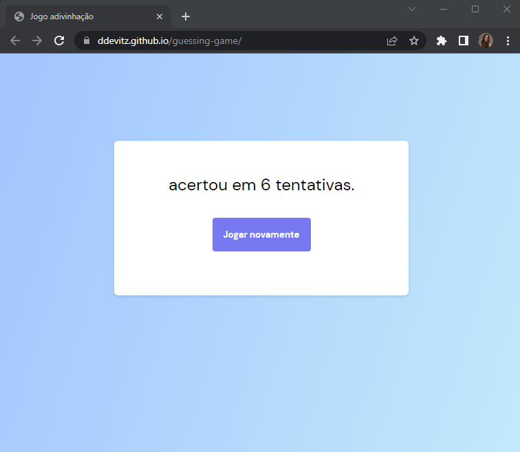

# Jogo de advinhação

Criamos em aula um jogo de advinhação, ele gera um número aleatório e você tem tentativas infinitas para tentar acertar. Ao final, quando acertar a resposta, ele trás o número de tentativas adicionadas.

## Screenshots

Tela inicial:

Após acertar a resposta:

